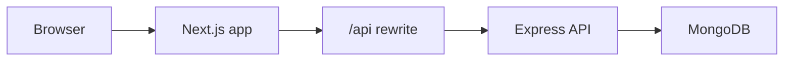

# PromptGrowth — Client

Next.js frontend for **PromptGrowth**, a full-stack AI prompt marketplace. Visitors browse the catalog; members unlock prompt details; Premium users access Pro content; creators publish prompts; admins moderate the platform.

> **Companion repo:** (https://github.com/tomalahmed/PromtGrowth-Server) (Express API)  

## Live Demo
https://promt-growth-client.vercel.app/


## Table of contents

- [Overview](#overview)
- [Tech stack](#tech-stack)
- [Architecture](#architecture)
- [User roles & access](#user-roles--access)
- [Features](#features)
- [Getting started](#getting-started)
- [Environment variables](#environment-variables)
- [Scripts](#scripts)
- [Project structure](#project-structure)
- [Routes & pages](#routes--pages)
- [Key flows](#key-flows)
- [Deploy on Vercel](#deploy-on-vercel)
- [Troubleshooting](#troubleshooting)

---

## Overview

PromptGrowth lets users discover, bookmark, and copy AI prompts. The client is a **Next.js App Router** application that talks to the API through a **same-origin proxy** (`/api` → backend), so JWT auth cookies work without cross-site configuration.

| Layer | Responsibility |
|-------|----------------|
| **Public site** | Landing, marketplace grid, pricing, about |
| **Auth** | Email/password + Google (Firebase popup) |
| **User hub** | Bookmarks, reviews, settings |
| **Creator hub** | Publish/edit prompts, analytics, collections |
| **Admin panel** | Moderation, users, payments, reports |

---

## Tech stack

| Category | Technology |
|----------|------------|
| Framework | Next.js 16 (App Router) |
| UI | React 19, Tailwind CSS v4 |
| Data | TanStack Query v5 |
| HTTP | Axios (`withCredentials: true`) |
| Auth | Firebase Auth (Google) + API JWT cookie |
| Payments | Stripe.js (`@stripe/stripe-js`) |
| Charts | Recharts |
| Motion | Framer Motion |
| Icons | Lucide React |

---

## Architecture



1. Browser requests `https://your-app.vercel.app/api/auth/login`
2. Next.js rewrites to `API_URL/api/auth/login` (Render)
3. API sets **httpOnly** `token` cookie on the response
4. Browser sends cookie on subsequent `/api/*` requests (same origin)

**Important:** `NEXT_PUBLIC_API_URL` must be `/api` in production. Do **not** point the browser directly at Render.

---

## User roles & access

| Role | How assigned | Main UI |
|------|--------------|---------|
| **Visitor** | Not signed in | Home, marketplace browse, pricing, about |
| **User** | Register / login (default role) | User hub + marketplace |
| **Premium user** | One-time Stripe payment (`isPremium: true`) | Unlocks Pro prompt content |
| **Creator** | Admin assigns role | Creator hub + publish prompts |
| **Admin** | `npm run seed:admin` on server | Admin panel + all hubs |

### Middleware protection (`src/middleware.js`)

| Path | Rule |
|------|------|
| `/prompts/[id]` | Requires `token` cookie → else redirect to `/login?redirect=...` |
| `/user/*`, `/creator/*`, `/admin/*` | Requires `token` cookie |
| `/login`, `/register` | Redirect to `/user` if already logged in |

API routes enforce **role** server-side (`RoleGuard` on client is UX only).

---

## Features

### Marketplace
- Filter by category, AI tool, difficulty; search and sort
- **Pro prompts** (`visibility: private`) show a badge + blurred preview for non-Premium users
- Guests redirected to login when opening prompt details

### Premium
- `/pricing` — one-time $5 Stripe checkout
- After payment: `verify-session` + webhook upgrade `isPremium`
- Locked content unlocks across marketplace and bookmarks

### User hub (`/user`)
- Dashboard overview, bookmarks, reviews, settings, help

### Creator hub (`/creator`)
- Create/edit prompts with **Pro prompt** toggle
- My prompts table, analytics, collections, sales placeholder, settings

### Admin panel (`/admin`)
- Prompt moderation (approve / reject / feature)
- User management (role changes)
- Payments, reports, analytics

### Other
- `/about` — platform access explained
- `/demo` — sandbox accounts (when `NEXT_PUBLIC_ENABLE_DEMO=true`)

---

## Getting started

### Prerequisites

- Node.js **18+**
- API server running locally ([server README](../Marketplace-Platform-Server/README.md))

### Install & run

```bash
cd Marketplace-Platform
npm install
cp .env.local.example .env
# Fill in Firebase, Stripe, etc.
npm run dev
```

Open **http://localhost:3000**

### With API (two terminals)

```bash
# Terminal 1 — API
cd Marketplace-Platform-Server
npm run dev

# Terminal 2 — Client
cd Marketplace-Platform
npm run dev
```

---

## Environment variables

Copy `.env.local.example` → `.env` (local) or set in **Vercel dashboard** (production).

### Core

| Variable | Local | Production | Description |
|----------|-------|------------|-------------|
| `NEXT_PUBLIC_API_URL` | `/api` | `/api` | Axios base URL in browser |
| `API_URL` | `http://localhost:5000` | `https://your-api.onrender.com` | Rewrite target (no `/api` suffix) |
| `NODE_ENV` | `development` | `production` | Build mode |

### Firebase (Google sign-in)

| Variable | Description |
|----------|-------------|
| `NEXT_PUBLIC_FIREBASE_API_KEY` | Web API key |
| `NEXT_PUBLIC_FIREBASE_AUTH_DOMAIN` | e.g. `project-id.firebaseapp.com` |
| `NEXT_PUBLIC_FIREBASE_PROJECT_ID` | **Must match** server `FIREBASE_PROJECT_ID` |
| `NEXT_PUBLIC_FIREBASE_STORAGE_BUCKET` | Firebase storage bucket |
| `NEXT_PUBLIC_FIREBASE_MESSAGING_SENDER_ID` | Sender ID |
| `NEXT_PUBLIC_FIREBASE_APP_ID` | Web app ID |

Firebase Console → **Authentication** → enable Google → **Authorized domains** → add `localhost` and your Vercel domain.

### Payments & misc

| Variable | Description |
|----------|-------------|
| `NEXT_PUBLIC_STRIPE_PUBLISHABLE_KEY` | Stripe publishable key (`pk_test_...` or `pk_live_...`) |
| `NEXT_PUBLIC_CONTACT_EMAIL` | Shown on About / Register (creator requests) |
| `NEXT_PUBLIC_ENABLE_DEMO` | `true` locally; **`false` in production** |
| `NEXT_PUBLIC_IMGBB_API_KEY` | Thumbnail uploads (exposed in browser — prefer server proxy in prod) |

> `NEXT_PUBLIC_*` variables are inlined at **build time**. Redeploy after changing them on Vercel.

---

## Scripts

| Command | Description |
|---------|-------------|
| `npm run dev` | Start dev server (port 3000) |
| `npm run build` | Production build |
| `npm start` | Serve production build |
| `npm run lint` | Run ESLint |

---

## Project structure

```
Marketplace-Platform/
├── src/
│   ├── app/
│   │   ├── (site)/              # Public: home, prompts, pricing, about, demo
│   │   ├── (auth)/              # login, register
│   │   └── (dashboard)/
│   │       ├── user/            # User hub pages
│   │       ├── creator/         # Creator hub pages
│   │       └── admin/           # Admin panel pages
│   ├── components/
│   │   ├── dashboard/           # Role-specific shells, sidebars, panels
│   │   ├── prompts/             # PromptCard, detail, filters
│   │   ├── landing/             # Home sections
│   │   ├── pricing/
│   │   ├── auth/
│   │   └── shared/              # Navbar, Footer, etc.
│   ├── context/
│   │   └── AuthContext.jsx      # Auth state, login, googleLogin
│   ├── hooks/                   # usePrompts, useAuth, usePayment, …
│   ├── lib/
│   │   ├── axiosInstance.js     # API client (credentials)
│   │   ├── firebase.js
│   │   ├── stripe.js
│   │   └── promptUtils.js       # Pro lock helpers
│   ├── middleware.js            # Cookie-based route guard
│   └── utils/                   # navLinks, roleRedirect
├── next.config.mjs              # API rewrites + security headers
└── .env.local.example
```

---

## Routes & pages

### Public site

| Route | Page |
|-------|------|
| `/` | Landing (featured prompts, creators, CTA) |
| `/prompts` | Marketplace grid + filters |
| `/prompts/[id]` | Prompt detail (auth required via middleware) |
| `/pricing` | Premium checkout |
| `/about` | How access works (visitor / user / Premium / creator) |
| `/demo` | Demo account sandbox (if enabled) |

### Auth

| Route | Page |
|-------|------|
| `/login` | Email + Google sign-in |
| `/register` | Create account |

### User hub

| Route | Page |
|-------|------|
| `/user` | Dashboard overview |
| `/user/bookmarks` | Saved prompts |
| `/user/reviews` | My reviews |
| `/user/settings` | Profile |
| `/user/help` | FAQ |

### Creator hub

| Route | Page |
|-------|------|
| `/creator` | Overview |
| `/creator/add-prompt` | Create prompt |
| `/creator/edit-prompt/[id]` | Edit prompt |
| `/creator/my-prompts` | List + status |
| `/creator/analytics` | Stats charts |
| `/creator/collections` | Bookmarked inspiration |
| `/creator/sales` | Sales placeholder |
| `/creator/settings` | Profile |
| `/creator/help` | Creator FAQ |

### Admin panel

| Route | Page |
|-------|------|
| `/admin` | Overview |
| `/admin/prompts` | Moderation queue |
| `/admin/users` | User management |
| `/admin/payments` | Payment history |
| `/admin/reports` | Reported prompts |
| `/admin/analytics` | Platform analytics |
| `/admin/help` | Admin FAQ |

---

## Key flows

### Email login

1. `POST /api/auth/login` → JWT `token` cookie
2. `AuthContext` stores user from response
3. Redirect to role dashboard (`/user`, `/creator`, or `/admin`)

### Google login

1. Firebase `signInWithPopup` → `idToken`
2. `POST /api/auth/google-sync` with `idToken`
3. Server verifies with Firebase Admin → JWT cookie

### Premium upgrade

1. User clicks Subscribe on `/pricing`
2. `POST /api/payments/create-checkout-session` → Stripe Checkout
3. Return URL: `/pricing?payment=success&session_id=...`
4. Client calls `POST /api/payments/verify-session`
5. `refetchUser()` + invalidate prompt queries → Pro content unlocks

### Pro prompt (UI)

- **Pro badge** when `visibility === "private"`
- Free users see blurred `contentPreview`; Premium sees full `content`
- Logic: `isProPrompt()` / `isPromptContentLocked()` in `src/lib/promptUtils.js`

---

## Deploy on Vercel

### 1. Repository settings

- **Framework:** Next.js
- **Root directory:** `Marketplace-Platform` (if monorepo)
- **Build:** `npm run build`
- **Output:** default

### 2. Environment variables

```env
NODE_ENV=production
NEXT_PUBLIC_API_URL=/api
API_URL=https://your-service.onrender.com
NEXT_PUBLIC_ENABLE_DEMO=false

NEXT_PUBLIC_FIREBASE_API_KEY=...
NEXT_PUBLIC_FIREBASE_AUTH_DOMAIN=...
NEXT_PUBLIC_FIREBASE_PROJECT_ID=...
NEXT_PUBLIC_FIREBASE_STORAGE_BUCKET=...
NEXT_PUBLIC_FIREBASE_MESSAGING_SENDER_ID=...
NEXT_PUBLIC_FIREBASE_APP_ID=...

NEXT_PUBLIC_STRIPE_PUBLISHABLE_KEY=pk_live_...
NEXT_PUBLIC_CONTACT_EMAIL=admin@yourdomain.com
```

### 3. Server `CLIENT_URL`

On Render, set:

```env
CLIENT_URL=https://your-app.vercel.app
```

No trailing slash.

### 4. Post-deploy

- Add Vercel domain to Firebase authorized domains
- Test `/api/health` via browser: `https://your-app.vercel.app/api/health`
- Test login, marketplace, Premium checkout

### Google popup blocked?

Add to `next.config.mjs` `securityHeaders`:

```js
{ key: "Cross-Origin-Opener-Policy", value: "same-origin-allow-popups" }
```

---

## Troubleshooting

| Symptom | Likely cause | Fix |
|---------|--------------|-----|
| API calls fail / 404 | Wrong `API_URL` on Vercel | Set to Render base URL; redeploy |
| Login works locally, not prod | `CLIENT_URL` mismatch | Match Vercel URL exactly on server |
| Google popup blocked | COOP / browser | Allow popups; add COOP header |
| Google login 401 | Firebase project mismatch | Align client + server project IDs |
| Premium not unlocking | Stripe webhook / verify | Check `STRIPE_*` on server; test `verify-session` |
| Empty marketplace | DB not seeded | Run server `npm run seed` or `seed:admin` |
| `NEXT_PUBLIC_*` unchanged | Stale build | Redeploy after env change |
